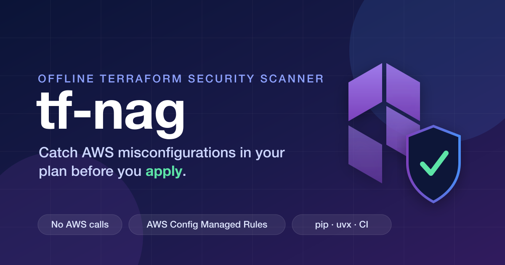

# tf-nag



`tf-nag` is an offline Python CLI that checks Terraform plan or state JSON
against the tf-nag AWS Solutions rules. It does not contact AWS.

Rule IDs and severity levels are derived from the upstream AWS Solutions pack:
https://github.com/cdklabs/cdk-nag. cdk-nag's Rules and Packs are in turn
derived from AWS Config managed rules and conformance packs, so a tf-nag
finding traces back through cdk-nag to an AWS-published control.

## Why tf-nag

Terraform makes it easy to ship AWS infrastructure, and just as easy to ship
infrastructure that is missing an access log, running an unencrypted volume,
holding a wildcard IAM policy, or pinned to a Lambda runtime AWS deprecated
long ago. You usually find out after it is live: during an audit, an incident,
or a surprise runtime end-of-life notice.

The cheapest place to catch all of that is `terraform plan`, before anything
reaches an account. `tf-nag` is a scanner you can run on a plan file, in a
pull request, with no credentials and no network. Its rule set *is* the AWS
Solutions pack, so "do I enforce control X" has a definite answer rather than
depending on which policies a general-purpose scanner happens to ship.

### How it compares to Checkov

[Checkov](https://www.checkov.io/) is a broad, multi-framework scanner with its
own large catalog of `CKV_*` policies. `tf-nag` is deliberately narrower: it
enforces the AWS Solutions / AWS Config lineage of controls on Terraform plans,
with full fidelity to that pack. The two are complementary; you can run both.

The difference that matters is provenance and completeness within that lineage.
Checkov's policies are its own and overlap with AWS best practices but are not
a one-to-one map of AWS Config rules, so coverage of any given control is a
maintainer judgment call. `tf-nag`'s rules are the AWS Solutions pack, so
nothing in that pack is silently skipped.

A concrete example motivated this. A team ran Checkov on every Terraform PR and
considered Lambda covered, until a function broke after AWS deprecated its
runtime. The plan had been shipping an old runtime for months and nothing in
the pipeline objected: the policies in play did not flag "this function is not
on the latest supported runtime for its language."

`tf-nag` closes that gap with **`AwsSolutions-L1`** (ERROR), the cdk-nag
`LambdaLatestVersion` control mapped onto `aws_lambda_function.runtime`. It
compares each function's runtime against the latest generally available runtime
for its language family (`python`, `nodejs`, `java`, `dotnet`, `ruby`, `go`)
and flags anything behind. The latest-runtime table is a vendored snapshot
refreshed from the official AWS Lambda supported-runtimes docs, public-preview
runtimes are accepted but kept distinct from GA so they do not falsely look
non-compliant, and container-image or custom `provided` runtimes are treated as
not-applicable.

## Installation

`tf-nag` is published on PyPI: https://pypi.org/project/tf-nag/.

Install it with `pip`:

```bash
pip install tf-nag
tf-nag --version
```

Or run it without installing, using `uvx`:

```bash
uvx tf-nag --version
```

To pin a specific release in a pipeline:

```bash
pip install tf-nag==0.1.0
```

### From source

To work on `tf-nag` itself, clone the repository and install its development
environment with `uv`:

```bash
git clone git@github.com:vumdao/terraform-nag.git
cd terraform-nag
uv sync --group dev
```

## Manual run (plan JSON)

```bash
terraform plan -out=tf.plan -refresh=false -lock=false
terraform show -json tf.plan > plan.json
tf-nag scan --plan-json plan.json
```

To scan a subdirectory or workspace, run the first two commands from that
directory (or select the workspace with `terraform workspace select NAME`) and
pass its resulting JSON path to `--plan-json`, for example:
`tf-nag scan --plan-json ./environments/prod/plan.json`.
The same workflow can be piped without an intermediate file:

```bash
terraform show -json tf.plan | tf-nag scan --plan-json -
```

### Example run

```
$ terraform plan -out=tf.plan -refresh=false -lock=false

module.demo_custom_domain.data.aws_route53_zone.hosted_zone[0]: Reading...
module.demo_svc.module.demo_lambda.data.aws_iam_policy_document.lambda_assume_role: Reading...
module.demo_svc.module.demo_lambda.data.aws_iam_policy_document.lambda_assume_role: Read complete after 0s [id=1792567899]
module.demo_svc.module.demo_lambda.data.aws_iam_policy_document.lambda_policy: Reading...
module.demo_svc.module.demo_lambda.data.aws_iam_policy_document.lambda_policy: Read complete after 0s [id=1012345678]
module.demo_custom_domain.data.aws_route53_zone.hosted_zone[0]: Read complete after 2s [id=Z45F22PP7P3PP]

No changes. Your infrastructure matches the configuration.

Terraform has compared your real infrastructure against your configuration and found no differences, so no changes are needed.

⚡ $ terraform show -json tf.plan > plan.json

⚡ $ tf-nag scan --plan-json plan.json
LEVEL       RULE              ADDRESS                         MESSAGE
ERROR       AwsSolutions-APIG1  module.demo_svc.module.demo_gw.aws_api_gateway_stage.demo-gw-stage  The API does not have access logging enabled.
ERROR       AwsSolutions-APIG2  module.demo_svc.aws_api_gateway_rest_api.demo-gw-api  The REST API does not have request validation enabled.
WARN        AwsSolutions-APIG3  module.demo_svc.module.demo_gw.aws_api_gateway_stage.demo-gw-stage  The REST API stage is not associated with AWS WAFv2 web ACL.
ERROR       AwsSolutions-APIG4  module.demo_svc.module.demo_gw.aws_api_gateway_method.demo-gw-method  The API does not implement authorization.
ERROR       AwsSolutions-APIG4  module.demo_svc.module.demo_gw.aws_api_gateway_method.demo-gw-options  The API does not implement authorization.
ERROR       AwsSolutions-COG4  module.demo_svc.module.demo_gw.aws_api_gateway_method.demo-gw-method  The API GW method does not use a Cognito user pool authorizer.
WARN        AwsSolutions-DDB3  module.demo_svc.module.demo_cached_table.aws_dynamodb_table.demo-ld-cached-table  The DynamoDB table does not have Point-in-time Recovery enabled.
ERROR       AwsSolutions-IAM5  module.demo_svc.module.demo_lambda.aws_iam_policy.demo-lambda-policy  The IAM entity contains wildcard permissions and does not have a tf-nag rule suppression with evidence for those permission.
```

Exit codes are **0** for clean (or when `--fail-on never` is used), **1** when
an ERROR finding is present, and **2** for WARN-only findings when
`--fail-on warn` is selected. **3** indicates a malformed suppression
configuration. The default `--fail-on error` reports WARN-only findings but
exits 0.

```bash
tf-nag scan --plan-json plan.json --format sarif
tf-nag list-rules
```

The plan-JSON loader also accepts state JSON. HCL parsing is intentionally
deferred; this phase is fully offline and has no runtime dependencies.

## Suppressions

The canonical file is `.tfnag.json` in the current directory. Pass
`--suppressions PATH` to select another file. If neither is passed explicitly,
`.tfnag.json` takes precedence over the legacy `.tfnag.yml`.

The JSON file may be either an object containing a `suppressions` array or a
bare top-level array:

```json
{
  "suppressions": [
    {
      "id": "AwsSolutions-APIG1",
      "resources": ["demo_gw.aws_api_gateway_stage.demo-gw-stage"],
      "reason": "Access logging handled centrally"
    }
  ]
}
```

`id` must be a registered rule ID. `resources` matches a full Terraform
address or a trailing suffix on whole `.`-segment boundaries, so the example
matches
`module.demo_svc.module.demo_gw.aws_api_gateway_stage.demo-gw-stage`, but not
`gw-stage` or `stage.demo-gw-stage`. `*` globs are supported within a segment.
An address without a `count`/`for_each` instance key matches every expanded
instance; an address with a key matches only that instance. Use
`"resources": ["*"]` to suppress every resource for that rule.

`reason` is mandatory and non-empty. `expires` is optional and must be
`YYYY-MM-DD`; expired entries do not suppress findings and are reported as
WARN with an expiration message. Suppressed findings remain visible in table,
Markdown, and JSON reports, including their reason. Table and Markdown
reports include a suppression summary and warn about entries that matched no
findings. `--strict` ignores all suppressions.

For back-compat, `.tfnag.yml` continues to support the restricted format below.
Create `.tfnag.yml` with one or more list items. The supported subset is
exactly a top-level sequence of mappings containing:

- `rule` (or `id`): an exact `AwsSolutions-*` ID, or `*`
- `address`: an optional shell-style glob, defaulting to `*`
- `reason`: a required non-empty string
- `expires`: an optional ISO date (`YYYY-MM-DD`)

For example:

```yaml
- rule: AwsSolutions-S1
  address: aws_s3_bucket.site
  reason: Access logs are delivered by the centralized platform account.
  expires: 2027-01-01
```

Address values are shell-style globs. Expired suppressions are not applied.
Unsupported YAML is silently ignored by the restricted parser: nested mappings,
flow-style lists, quoted multiline values, and unrelated top-level mappings are
not supported. `--strict` ignores all suppressions. Inline HCL comments are
deferred until the HCL loader exists (TODO).

## Rule coverage

`tf-nag list-rules` reads the vendored authoritative inventory and reports all
131 AWS Solutions rules:

| Status                      | Count |
| --------------------------- | ----: |
| implemented                 |   126 |
| not-applicable-to-terraform |     5 |
| not-implemented             |     0 |

The not-applicable rules have no Terraform provider resource equivalent.
Run `tf-nag list-rules` for the complete per-rule table.

## Development

```bash
uv sync --group dev
uv run ruff check .
uv run ruff format --check .
uv run pytest
```

Fixtures in `tests/fixtures` are hand-crafted documents matching the
`terraform show -json` schema. `tests/real-terraform/real-plan.json` is
generated by Terraform 1.9.8 with the AWS provider and is committed as a
real-plan integration fixture; it needs no AWS credentials to scan. Terraform
is not required to run the suite.
`python scripts/generate_rule_mapping.py` regenerates the mapping document from
the rule module docstrings.

## Limitations

This phase does not parse HCL, resolve resources created outside Terraform, inspect `null_resource`/local-exec or embedded CloudFormation, or provide baseline support. Dynamic policy documents that cannot be statically resolved are reported as UNKNOWN and follow `--unknown-as`. Terraform plan JSON does not contain source file or line locations; SARIF locations therefore contain Terraform resource addresses. The implementation follows the tf-nag AWS Solutions IDs and levels, not Checkov/tfsec IDs.
